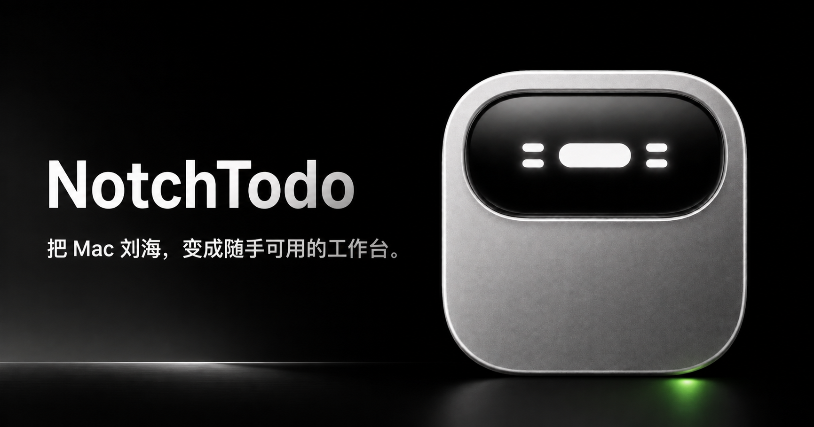

<p align="center">
  
</p>

<h1 align="center">NotchTodo</h1>

<p align="center">
  把 Mac 刘海，变成随手可用的工作台。<br>
  待办、剪贴板、Markdown 速记和常用应用，都收在屏幕顶端。
</p>

<p align="center">
  
  
  
  
</p>

<p align="center">
  <a href="https://notchtodo.chusimin.chatgpt.site"><strong>官网与交互演示</strong></a>
  ·
  <a href="https://github.com/chusimin/notch-todo/releases/latest"><strong>下载 macOS 版</strong></a>
  ·
  <a href="https://github.com/chusimin/notch-todo/issues"><strong>反馈问题</strong></a>
</p>

> [!NOTE]
> `main` 当前是 0.3.0 源码，公开安装包仍为 v0.2.0。新版界面、官网与 Codex/GPT 完成提醒已经进入源码，但尚未制作新的 GitHub Release。

## NotchTodo 是什么

NotchTodo 是一款常驻 macOS 屏幕顶部的本地工作台。平时收成 200px 宽的刘海，点一下从屏幕顶部展开；用完后点击空白处、按 `Esc` 或切到其他窗口即可收起。

它没有账号、后端和云同步。工作内容默认只留在这台 Mac。

## 四个工作区

| 页面 | 你可以做什么 |
|---|---|
| **首页** | 查看时间与日期；打开最多 6 个收藏应用；编辑并预览 Markdown 速记；按需开启镜子；一键取回收藏剪贴 |
| **待办** | 用 P0–P3 的 2 × 2 优先级矩阵安排事项；一次回车新增；完成、恢复、删除与 5 秒撤销 |
| **剪贴板** | 自动保存文字、链接与图片；按类型筛选、收藏、删除、清空或写回系统剪贴板；长内容自动省略 |
| **应用** | 搜索并启动本机应用；收藏常用应用；拖拽调整顺序；左侧收藏固定，右侧应用列表独立滚动 |

四页使用统一的 1120 × 540 内容区，窄屏会自动留出安全边距。窗口始终贴在当前屏幕顶部，切换页面时不会忽大忽小。

### Markdown 速记

支持标题、粗体、斜体、删除线、列表、任务列表、引用、分隔线、行内代码、代码块和 `http/https` 链接。输入内容自动保存在本机；预览不会执行原始 HTML，也不会加载 Markdown 远程图片。

### 剪贴板历史

- 支持文字、链接与图片，最多保留 100 条
- 文字卡片固定高度，超出部分显示省略号；时间信息保留
- 类型只用浅描边区分，没有左侧色条和冗余标签
- `⌘ ⇧ V` 可从任意应用召唤剪贴板页面
- 检测到 `org.nspasteboard.ConcealedType` 时跳过记录

> 普通文本形式复制的密码或敏感信息仍可能进入本机历史。NotchTodo 不是密码识别工具，请按需删除或清空记录。

## 安装

当前正式支持 Apple Silicon（M1 及更新芯片）与 macOS 11+。

1. 从 [GitHub Releases](https://github.com/chusimin/notch-todo/releases/latest) 下载最新的 `NotchTodo-*-arm64.dmg`
2. 打开 DMG，把 `NotchTodo.app` 拖进「应用程序」
3. 第一次启动若被 Gatekeeper 拦截，在 Finder 中右键 `NotchTodo`，选择「打开」并再次确认

也可以在终端移除隔离标记：

```bash
xattr -cr /Applications/NotchTodo.app
```

启动后，NotchTodo 会出现在屏幕顶部正中和菜单栏中。默认注册为登录项，可从菜单栏图标的菜单里关闭开机启动。

## 常用操作

| 操作 | 结果 |
|---|---|
| 点击折叠刘海 | 展开工作台 |
| 点击顶栏空白处、收起按钮或面板外，或按 `Esc` | 收起工作台 |
| 在待办输入框按 `Enter` | 新增待办 |
| 点击剪贴板卡片 | 写回系统剪贴板 |
| 按 `⌘ ⇧ V` | 召唤并打开剪贴板页面 |
| 点击应用图标 | 启动对应应用 |
| 点击首页镜子 | 请求摄像头权限并开始预览；再次点击、离开首页或收起时立即停止 |

## Codex / GPT 完成提醒

任务提醒是可选的本机集成，不是安装后自动接管 Codex 或 GPT。配置 Hook，或向本机接口发送事件后，NotchTodo 会在屏幕顶部弹出一个不抢焦点的提醒；悬停暂停倒计时，点击关闭。

```bash
curl -X POST http://127.0.0.1:43821/notify/codex \
  -H 'Content-Type: application/json' \
  -d '{"title":"官网 README 已更新","project":"NotchTodo","task_id":"readme-update"}'
```

GPT 使用同样的数据格式，把地址改为 `/notify/gpt`。健康检查地址是 `http://127.0.0.1:43821/health`。

当前提醒只负责即时通知：不保存完成历史，也不能点击跳转到对应对话。服务只监听 `127.0.0.1`，不会暴露给局域网或公网。

## 数据与隐私

- 待办、速记、收藏、应用顺序与剪贴板元数据保存在 Electron 的 LocalStorage
- 剪贴板图片保存在 `~/Library/Application Support/notch-todo/clipboard-images/`
- 镜子默认关闭，离开首页或收起后立即释放摄像头轨道
- 没有账号、云同步、行为分析或内容上传接口

<details>
<summary>LocalStorage 数据键</summary>

| Key | 内容 |
|---|---|
| `notch-todo-data` | P0–P3 待办数据 |
| `notch-home-note` | Markdown 速记原文 |
| `notch-clip-history` | 剪贴板历史元数据 |
| `notch-clip-favorites` | 收藏剪贴 ID |
| `notch-app-favorites` | 收藏应用路径 |
| `notch-app-order` | 应用拖拽排序 |
| `notch-active-tab` | 上次打开的页面 |

</details>

## 从源码运行

桌面应用使用 Electron 33 + 原生 HTML/CSS/JavaScript，没有前端构建步骤。

```bash
git clone https://github.com/chusimin/notch-todo.git
cd notch-todo
npm install
npm test
npm start
```

桌面端命令：

| 命令 | 用途 |
|---|---|
| `npm test` | 检查主进程、预加载脚本与渲染脚本的 JavaScript 语法 |
| `npm start` | 启动 Electron 开发版 |
| `npm run build` | 构建 Apple Silicon DMG |
| `npm run build:zip` | 构建 Apple Silicon ZIP |
| `npm run pack` | 生成未安装的应用目录 |

> 未经用户确认，不执行正式打包或发布。

### 官网开发

官网源码位于 [`website/`](website/README.md)，使用 React 19、Vinext 与原生 CSS，要求 Node.js 22.13.0 或更高版本。

```bash
cd website
npm install
npm run dev
npm run lint
npm run build
```

## 项目结构

```text
.
├── main.js                 # Electron 主进程：窗口、菜单栏、多屏、剪贴板与通知服务
├── preload.js              # 安全的 contextBridge API
├── renderer/               # 桌面端 HTML、CSS、交互与通知窗口
├── build/                  # electron-builder 签名脚本与 entitlements
├── docs/                   # 产品设计说明与 README 素材
├── website/                # 官网源码与公开素材
├── package.json            # 桌面端命令与打包配置
└── README.md
```

更详细的界面规格见 [`docs/DASHBOARD-DESIGN.md`](docs/DASHBOARD-DESIGN.md)。

## 当前限制

- 仅正式支持 Apple Silicon Mac；Intel、Windows 与 Linux 尚未验证
- 安装包采用 ad-hoc 签名，尚未完成 Apple 公证
- 数据只保存在本机，不提供跨设备同步
- 暂无自动更新，升级需要重新下载 Release
- Codex/GPT 提醒暂无历史记录与对话跳转

欢迎提交 [Issue](https://github.com/chusimin/notch-todo/issues) 或 Pull Request。

## License

项目在 `package.json` 中声明为 MIT。独立的 `LICENSE` 文件尚待补充。
