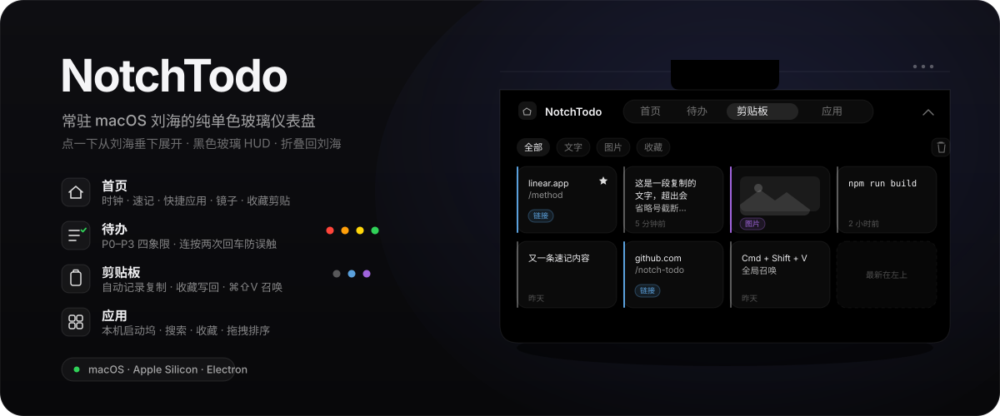

<p align="center">
  
</p>

<h1 align="center">NotchTodo</h1>

<p align="center">
  一个常驻 macOS 屏幕顶部刘海位置的纯单色玻璃仪表盘。<br>
  默认折叠成刘海大小，点一下从刘海垂下展开，含 <b>首页 / 待办 / 剪贴板 / 应用</b> 四个 Tab，再点收起。
</p>

<p align="center">
  
  
  
  
</p>

<p align="center">
  <a href="https://notchtodo.chusimin.chatgpt.site"><strong>访问官网</strong></a>
  ·
  <a href="https://github.com/chusimin/notch-todo/releases/latest"><strong>下载最新版</strong></a>
</p>

---

## 它长什么样

```
       折叠态                          展开态（四个 Tab 统一 1120 × 540）
   ┌──────────┐               ┌──────────────────────────────────────────────┐
   │   刘海   │   ──点击──>   │ ◍ [ 首页 ][ 待办 ][ 剪贴板 ][ 应用 ]        ⌃ │
   └────╍─────┘               │ [全部][文字][图片][收藏]                    🗑 │
       ↑                      │ ┌────────┬────────┬────────┬────────┐        │
 200×菜单栏高                 │ │ 链接·星 │  文字   │ 图片卡 │ 文字   │  最新  │
 （抓握小药丸）               │ └────────┴────────┴────────┴────────┘  在左上 │
                              └──────────────────────────────────────────────┘
```

- 纯黑底（OLED #000000）+ 发丝边框 + 顶部高光，做出玻璃厚度与呼吸感
- 全程以黑灰为主，强调色仅用于待办 P0–P3、剪贴板浅描边、状态点与应用原生图标
- 左上分段控件切换四 Tab，激活胶囊滑动 + 内容交叉淡入；四页使用统一窗口尺寸，切换时不再忽大忽小，并记住上次所在 Tab
- 动效对齐 **Linear**：`cubic-bezier(.25,.46,.45,.94)` 无回弹曲线、100–160ms 时长；切 Tab 免重复重建、非激活面板 `content-visibility` 跳过布局，展开时延后重活，主进程窗口零动画（防卡顿铁律）
- 折叠态高度 = **菜单栏高（≈物理刘海高）**，一像素不超出物理刘海；靠下沿一颗常态可见的抓握小药丸提示可点
- 启动/重新居中跟随鼠标所在屏；展开/收起/切 Tab 锚定窗口所在屏（不跟光标跨屏瞬移）
- 菜单栏小图标用 template image 自动深浅色适配

---

## 四个 Tab

| Tab | 能力 |
|---|---|
| **首页 Home** | **两行 bento**：实时**时钟·日期**／**快捷应用**（与应用 Tab 收藏同源）／支持标题、列表、引用、代码与链接的 **Markdown 速记**（编辑/预览，输入即存）／点按才开启的**镜子**；下排是可直接写回系统剪贴板的**收藏剪贴** |
| **待办 Todo** | P0–P3 **2 × 2 优先级矩阵**，支持新增 / 勾选 / 删除 / 计数；输入后按回车即可添加 |
| **剪贴板 Clip** | 自动记录复制的**文字·链接·图片**，自适应等高卡片（最新在左上，过长内容省略）；只用浅描边区分类型，不再使用左侧色条或类型标签；支持**收藏 / 删除 / 清空 / 过滤**，点条目写回系统剪贴板，重复内容以最新一次为准，全局 **Cmd+Shift+V** 召唤 |
| **应用 Apps** | 本机**应用启动坞**：左侧「常用」固定不动，右侧应用列表独立滚动；支持搜索、收藏、拖拽排序与点击启动 |

---

## 关键设计

- 四个 Tab 统一使用 **1120 × 540** 的内容尺寸；切换时只替换内容，不再改变原生窗口宽高。折叠刘海是 **200 × 菜单栏高（≈物理刘海高）**，一像素不超出物理刘海，靠下沿抓握小药丸提示可点
- 纯单色玻璃材质：黑底 + 发丝边框 `rgba(255,255,255,0.08)` + 顶部 1px 高光
- 强调色只用于待办 P0–P3、剪贴板的浅类型描边、状态点与 app 原生图标；列表不使用左侧色条
- 动效对齐 **Linear**（实测取值）：`cubic-bezier(0.25, 0.46, 0.45, 0.94)` 无回弹主曲线、时长收紧 100–160ms；展开大手势 340ms expo-out，Tab 切换交叉淡入；窗口本身零动画（防卡顿铁律），流畅感全在渲染层 CSS
- 完整设计规格见 [`docs/DASHBOARD-DESIGN.md`](docs/DASHBOARD-DESIGN.md)（唯一取值依据）

---

## 数据存储

数据持久化在浏览器 LocalStorage（位于 `~/Library/Application Support/notch-todo/Local Storage/`），关机重启不丢：

| Key | 内容 |
|---|---|
| `notch-todo-data` | 四象限待办 `{P0,P1,P2,P3}`，item `{id,text,done,createdAt}` |
| `notch-home-note` | 首页速记的原始 Markdown 文本 |
| `notch-clip-history` | 剪贴板历史 `[{id,type,text,imagePath,timestamp}]`，最新在头，FIFO 上限 100（图片仅存路径，dataURL 只在内存缓存不入 LocalStorage） |
| `notch-clip-favorites` | 剪贴板收藏 `[id, ...]`（首页「收藏剪贴」与剪贴板 Tab 同源） |
| `notch-app-favorites` | 应用收藏 `[appPath, ...]`（首页快捷应用与应用 Tab「常用」同源） |
| `notch-app-order` | 「全部应用」拖拽自定义顺序 `[appPath, ...]` |
| `notch-active-tab` | 上次所在 Tab：`'home' | 'todo' | 'clip' | 'apps'` |

> 剪贴板图片写盘到 `~/Library/Application Support/notch-todo/clipboard-images/`，元数据存 LocalStorage；主进程 500ms 轮询系统剪贴板（Electron 无 changeCount，靠内容指纹去重），FIFO 淘汰时连带删图。

---

## 隐私

- **镜子摄像头默认不开**：首页镜子 tile 显示占位圆，点按才 `getUserMedia` 激活
- **离开即释放**：切走首页 Tab、收起面板或再次点击，立即 `track.stop()` 释放摄像头
- **剪贴板跳过敏感内容**：密码管理器写入的 `org.nspasteboard.ConcealedType`（1Password / Bitwarden 等）不记录
- 所有数据仅存本机（LocalStorage + userData 图片目录），无云端、无网络上传
- Codex/GPT 完成提醒只在 `127.0.0.1:43821` 本机回环地址接收，不对局域网或公网开放

---

## 命令

```bash
npm install   # 安装依赖
npm test      # JavaScript 语法与发布入口检查
npm start     # 启动开发（改完 main.js / renderer/* 直接看效果，无构建步骤）
npm run build # 打包 .dmg（electron-builder）
```

> 安装、Gatekeeper 首次打开、签名与打包细节见下文「从源码构建」。

---

## 安装（普通用户）

> 仅支持 macOS Apple Silicon (M1/M2/M3/M4)，系统要求 macOS 11+。Intel Mac 请走「从源码构建」。

1. 从 [Releases](https://github.com/chusimin/notch-todo/releases) 下载最新 `NotchTodo-x.y.z-arm64.dmg`
2. 双击 dmg → 把 `NotchTodo.app` 拖进 `Applications`
3. 首次打开被 Gatekeeper 拦截时，任选其一：
   - **右键打开**：Finder → 应用程序里 **Control 点击**（或右键）`NotchTodo` → 选「打开」→ 再点「打开」确认
   - **终端一行**：`xattr -cr /Applications/NotchTodo.app`

装好后屏幕顶部正中出现黑色刘海条，menu bar 出现小刘海图标，默认已注册系统登录项（开机自启，可在右键菜单切换）。

---

## 使用方法

| 操作 | 效果 |
|---|---|
| 点击折叠刘海条（下沿抓握小药丸提示可点） | 从刘海垂下展开仪表盘（菜单栏保持可见，面板悬挂其下） |
| 点顶栏空白 / 右上收起钮 / 面板外任意处 / Esc | 收起回刘海形态（失焦自动收起） |
| 顶部分段控件 | 切换 首页 / 待办 / 剪贴板 / 应用，记住上次所在 Tab |
| 待办输入框内按下 **Enter** | 新增一条待办 |
| 点圆形勾选框 | 标记完成 / 取消完成 |
| 鼠标移到待办上 → 点 × | 删除该条 |
| 复制任意文字 / 链接 / 图片 | 自动进剪贴板 Tab 历史（最新在左上）；重复内容以最新一次为准 |
| 点剪贴板条目 | 写回系统剪贴板，去别处 Cmd+V 秒粘；悬浮浮出收藏 / 删除钮 |
| 全局 **Cmd+Shift+V** | 任意应用里召唤刘海并直接切到剪贴板 Tab |
| 首页「收藏剪贴」条 | 点一下写回系统剪贴板（收藏与剪贴板 Tab 同源） |
| 首页镜子圆点击 | 打开摄像头预览；离开首页或再次点击释放 |
| 应用搜索框输入 / 点击图标 | 实时过滤本机应用 / 真实启动 |
| Codex 完成一轮任务 | 屏幕顶部弹出独立完成提醒，不抢走当前窗口焦点；悬停暂停，点击关闭 |
| 点 menu bar 小刘海图标 | 弹菜单：显示/隐藏、重新居中、测试完成提醒、开机自启、关于、退出 |

---

## 从源码构建（开发者）

```bash
git clone https://github.com/chusimin/notch-todo.git
cd notch-todo
npm install
npm start
```

代码无构建步骤，改完 `main.js` / `renderer/*` 后 `npm start` 直接看效果。

### 打包 .dmg

```bash
npm run build
```

产物：`dist/NotchTodo-x.y.z-arm64.dmg`。构建关键点：

- `asar: false` — 关闭 Asar Integrity 校验，避免重签后 hash 不一致
- `mac.identity: null` + `afterPack` 钩子 — electron-builder 跳过签名后，由 [`build/afterPack.js`](build/afterPack.js) 用 `codesign --sign -` 按「内→外」顺序对整个 bundle 做 ad-hoc 重签
- `extendInfo` 注入 `NSCameraUsageDescription`（镜子摄像头授权说明）；不覆盖 `CFBundleName`，否则启动期会按错名字找 Helper bundle 直接 trap

### 启用真签名（消除 Gatekeeper 警告）

1. 在 Apple Developer 后台办 "Developer ID Application" 证书并导入钥匙串
2. 编辑 `package.json`：把 `"identity": null` 改成你的证书名（如 `"Developer ID Application: Your Name (TEAMID)"`）
3. （可选）启用 hardened runtime + notarization，[`build/entitlements.mac.plist`](build/entitlements.mac.plist) 已预留 JIT 与摄像头 entitlements

---

## 项目结构

```
.
├── main.js                       # 主进程：窗口、Tray、多屏适配、自启、应用列举 IPC、剪贴板轮询 + 全局快捷键
├── preload.js                    # contextBridge 安全桥接（listApps / launchApp / openExternal / clipboard 读写 …）
├── renderer/
│   ├── index.html                # 4-Tab DOM（首页 / 待办 / 剪贴板 / 应用）
│   ├── styles.css                # 纯单色玻璃样式 + 设计 token
│   ├── app.js                    # LocalStorage 持久化 + 四 Tab 交互 + Markdown 预览
│   ├── notification.html         # 独立任务完成提醒窗口
│   ├── notification.css          # 提醒窗口样式与收展动效
│   ├── notification.js           # 提醒展示、暂停、队列与关闭交互
│   └── assets/app-logo-128.png   # 提醒窗口使用的小尺寸 Logo
├── docs/
│   └── DASHBOARD-DESIGN.md        # 仪表盘设计规格（唯一取值依据）
├── build/
│   ├── afterPack.js              # electron-builder afterPack：递归 ad-hoc 签名
│   └── entitlements.mac.plist    # 预留 entitlements（摄像头 / JIT）
├── package.json                  # 依赖 + electron-builder 配置
├── CLAUDE.md                     # 项目规范（vibe coding harness）
└── dist/                         # 打包产物（已 .gitignore）
```

---

## 技术栈

- **Electron 33** — 桌面 shell
- **原生 HTML/CSS/JS** — 无构建步骤、无框架、无前端依赖
- **LocalStorage** — 本机数据持久化，无后端
- **本机回环通知服务** — 接收 Codex/GPT 完成事件，不对外网开放
- **electron-builder 25** — 打包到 .dmg

---

## 已知问题 / Roadmap

- [ ] Intel x64 包：electron-builder 在路径含中文时打包失败，需要把项目复制到纯英文路径再构建
- [ ] Windows / Linux 支持：当前完全 macOS 专属（依赖 `screen-saver` window level、`app.dock.hide()`、`app.getFileIcon` 等 macOS API）
- [ ] iCloud 同步：目前数据只在本机 LocalStorage，跨设备不同步
- [ ] 自动更新：需配置 GitHub Release + `electron-updater`

欢迎 Issue / PR。

---

## License

MIT
